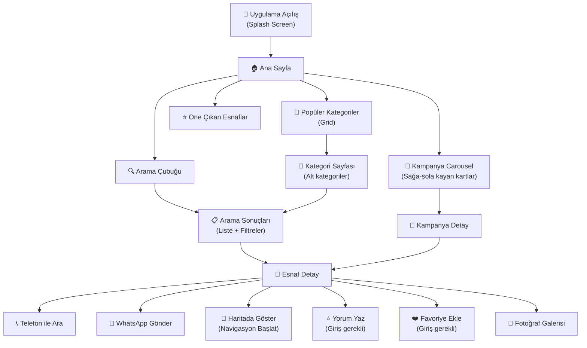

# 🏘️ Sungurlum — Kapsamlı Uygulama Geliştirme Planı (v2)

> **Son Güncelleme:** 27 Haziran 2026  
> **Platform:** React Native + Expo (Expo Go ile test)  
> **Hedef:** Android + iOS  
> **Dil:** Sadece Türkçe

---

## Proje Özeti

Çorum Sungurlu ilçesine özel, yerel esnafların, zanaatkarların ve hizmet verenlerin listelendiği; kullanıcıların kayıt olmadan ihtiyaçlarına göre arama yapıp iletişim kurabildiği bir mobil rehber & reklam platformu.

---

## Kesinleşen Kararlar

| Karar | Sonuç |
|---|---|
| **Uygulama Adı** | Sungurlum |
| **Admin Paneli** | Uygulama içi (mobilde yoldayken müdahale edebilmek için) |
| **Ödeme Sistemi** | Başlangıçta manuel (elden/havale/EFT), sonra İyzico entegrasyonu |
| **Kullanıcı Kayıt** | Hibrit — arama/listeleme kayıtsız, yorum/favori için kayıt gerekli |
| **Dil** | Sadece Türkçe |
| **Mesajlaşma** | Yok — telefon numarası ve WhatsApp butonu yeterli |
| **Üyelik Paketleri** | İçerik detayları lansmanla birlikte belirlenecek |
| **Logo** | Henüz hazır değil — tasarım önerisi sunulacak |

---

## Onaylanan Özellikler

### ✅ Dahil Edilecek

| # | Özellik | Detay |
|---|---|---|
| 1 | **Arama Sistemi** | Basit, hızlı, sade — aradığını anında bulsun |
| 2 | **Kategori Sistemi** | Ana kategoriler + alt kategoriler, görselli grid |
| 3 | **Esnaf Detay Sayfası** | Bilgiler, fotoğraflar, konum, iletişim butonları |
| 4 | **Kampanya Carousel** | Ana sayfada Getir tarzı kayan kartlar |
| 5 | **Değerlendirme & Yorum** | 1-5 yıldız + yorum, admin onayından geçecek |
| 6 | **Harita Entegrasyonu** | Esnaf konumu haritada, navigasyon başlatma |
| 7 | **Bildirimler** | Yeni kampanya, üyelik hatırlatma, favori esnaf bildirimi |
| 8 | **Favoriler** | Beğenilen esnafı kaydetme (kayıtlı kullanıcılar) |
| 9 | **Esnaf Fotoğraf Galerisi** | Portfolyo/iş örnekleri — rekabet ve güven artırıcı |
| 10 | **Esnaf Dashboard** | Görüntülenme, tıklanma, kategori arama istatistikleri |
| 11 | **Öne Çıkarma (Boost)** | Arama sonuçlarında üste çıkma (ücretli) + uygulama içi öneri |
| 12 | **Acil Durumlar** | 112, İtfaiye, Nöbetçi Eczane, Polis, Veteriner |
| 13 | **Resmi Kurumlar** | Park, hastane, belediye, kaymakamlık vb. |
| 14 | **Esnaf Başvuru Formu** | Uygulama üzerinden başvuru → admin onayı |
| 15 | **Reklam/Kampanya Talebi** | Esnaf reklam süresi seçip talep gönderir → admin onaylar |
| 16 | **Admin Paneli (Uygulama İçi)** | Esnaf onaylama, reklam yönetimi, yorum moderasyonu |

### ❌ Dahil Edilmeyecek

| Özellik | Neden |
|---|---|
| Uygulama içi mesajlaşma | Esnaf meşgulken bakamaz, telefon/WhatsApp yeterli |
| Çoklu dil desteği | Hedef kitle sadece Türkçe konuşanlar |
| Web admin paneli | Mobil uygulama içinden yönetim yeterli |

---

## Teknik Mimari

### Teknoloji Stack'i

| Katman | Teknoloji | Neden? |
|---|---|---|
| **Framework** | React Native + Expo SDK 53 | Cross-platform, Expo Go ile kolay test |
| **Navigasyon** | Expo Router (file-based) | Modern, kolay, performanslı |
| **Backend** | Firebase (Firestore + Auth + Storage + Cloud Functions) | Sunucusuz, ücretsiz katman, hızlı geliştirme |
| **Harita** | `react-native-maps` + Google Maps API | Konum gösterme, navigasyon |
| **Bildirimler** | Expo Notifications + Firebase Cloud Messaging | Push notification |
| **State** | Zustand | Hafif, basit, performanslı |
| **Animasyonlar** | React Native Reanimated + Gesture Handler | Akıcı animasyonlar, carousel swipe |
| **Görseller** | Expo Image | Hızlı yükleme, cache |
| **İkonlar** | `@expo/vector-icons` (MaterialCommunityIcons) | Zengin ikon seti |
| **Font** | Google Fonts (Poppins + Inter) | Modern, okunabilir tipografi |

### Proje Yapısı

```
sungurlum/
├── app/                              # Expo Router — Sayfa yapısı
│   ├── _layout.tsx                   # Root layout (font yükleme, tema)
│   ├── (tabs)/                       # Alt tab navigasyonu
│   │   ├── _layout.tsx               # Tab bar yapılandırması
│   │   ├── index.tsx                 # 🏠 Ana Sayfa
│   │   ├── categories.tsx            # 📂 Kategoriler
│   │   ├── favorites.tsx             # ❤️ Favorilerim
│   │   └── profile.tsx               # 👤 Profil / Ayarlar
│   │
│   ├── search/
│   │   └── [query].tsx               # 🔍 Arama sonuçları
│   │
│   ├── business/
│   │   └── [id].tsx                  # 🏪 Esnaf detay sayfası
│   │
│   ├── category/
│   │   └── [slug].tsx                # 📁 Kategori içi listeleme
│   │
│   ├── auth/
│   │   ├── login.tsx                 # Kullanıcı giriş
│   │   └── register.tsx              # Kullanıcı kayıt
│   │
│   ├── apply/
│   │   ├── business.tsx              # Esnaf başvuru formu
│   │   └── campaign.tsx              # Reklam/kampanya talebi
│   │
│   ├── campaign/
│   │   └── [id].tsx                  # 📢 Kampanya detay
│   │
│   ├── emergency.tsx                 # 🚨 Acil durumlar
│   │
│   ├── map.tsx                       # 🗺️ Harita görünümü
│   │
│   └── admin/                        # 🔐 Admin paneli (uygulama içi)
│       ├── _layout.tsx               # Admin layout (yetki kontrolü)
│       ├── index.tsx                 # Admin dashboard
│       ├── businesses.tsx            # Esnaf başvuru onaylama
│       ├── campaigns.tsx             # Reklam yönetimi
│       ├── reviews.tsx               # Yorum moderasyonu
│       └── stats.tsx                 # Genel istatistikler
│
├── components/                       # Yeniden kullanılabilir bileşenler
│   ├── ui/                           # Temel UI bileşenleri
│   │   ├── Button.tsx
│   │   ├── Card.tsx
│   │   ├── Input.tsx
│   │   ├── Badge.tsx
│   │   ├── Modal.tsx
│   │   └── LoadingSpinner.tsx
│   │
│   ├── SearchBar.tsx                 # Arama çubuğu
│   ├── BusinessCard.tsx              # Esnaf listesi kartı
│   ├── BusinessDetail.tsx            # Esnaf detay bileşenleri
│   ├── CampaignCarousel.tsx          # Kampanya slider
│   ├── CampaignCard.tsx              # Tek kampanya kartı
│   ├── CategoryGrid.tsx              # Kategori ızgarası
│   ├── CategoryCard.tsx              # Tek kategori kartı
│   ├── RatingStars.tsx               # Yıldız puanlama
│   ├── ReviewCard.tsx                # Yorum kartı
│   ├── ReviewForm.tsx                # Yorum yazma formu
│   ├── MapPreview.tsx                # Mini harita önizleme
│   ├── ImageGallery.tsx              # Esnaf fotoğraf galerisi
│   ├── ContactButtons.tsx            # Ara / WhatsApp / Harita butonları
│   ├── EmergencyCard.tsx             # Acil durum kartı
│   ├── FeaturedBusiness.tsx          # Öne çıkan esnaf
│   ├── StatsCard.tsx                 # İstatistik kartı (esnaf dashboard)
│   ├── BoostPrompt.tsx               # "Öne çıkmak ister misiniz?" önerisi
│   └── AdminActionCard.tsx           # Admin onay/red kartı
│
├── services/                         # Firebase & API servisleri
│   ├── firebase.ts                   # Firebase yapılandırması
│   ├── auth.ts                       # Kimlik doğrulama işlemleri
│   ├── businesses.ts                 # Esnaf CRUD + arama
│   ├── campaigns.ts                  # Kampanya CRUD
│   ├── reviews.ts                    # Yorum CRUD
│   ├── categories.ts                 # Kategori işlemleri
│   ├── favorites.ts                  # Favori işlemleri
│   ├── notifications.ts             # Bildirim gönderme/alma
│   ├── stats.ts                      # İstatistik toplama
│   ├── admin.ts                      # Admin işlemleri
│   └── storage.ts                    # Görsel yükleme
│
├── stores/                           # Zustand state management
│   ├── authStore.ts                  # Kullanıcı oturum durumu
│   ├── searchStore.ts                # Arama geçmişi/sonuçları
│   ├── favoritesStore.ts             # Favoriler
│   └── notificationStore.ts         # Bildirim durumu
│
├── hooks/                            # Custom React hooks
│   ├── useAuth.ts                    # Kimlik doğrulama hook
│   ├── useBusinesses.ts              # Esnaf veri hook
│   ├── useCampaigns.ts               # Kampanya veri hook
│   ├── useLocation.ts                # Konum izinleri ve GPS
│   ├── useSearch.ts                  # Arama mantığı
│   └── useAdmin.ts                   # Admin yetki kontrolü
│
├── constants/                        # Sabitler
│   ├── theme.ts                      # Renkler, spacing, fontlar
│   ├── categories.ts                 # Kategori verileri
│   ├── emergencyNumbers.ts           # Acil durum numaraları
│   └── config.ts                     # Uygulama yapılandırması
│
├── types/                            # TypeScript tip tanımları
│   ├── business.ts
│   ├── campaign.ts
│   ├── review.ts
│   ├── user.ts
│   ├── category.ts
│   └── navigation.ts
│
├── utils/                            # Yardımcı fonksiyonlar
│   ├── formatters.ts                 # Tarih, telefon formatlama
│   ├── validators.ts                 # Form doğrulama
│   └── helpers.ts                    # Genel yardımcılar
│
└── assets/                           # Statik dosyalar
    ├── images/
    ├── icons/
    └── fonts/
```

### Firebase Veritabanı Şeması

```
Firestore Collections:

📁 users/
└── {userId}
    ├── displayName: string
    ├── email: string
    ├── phone: string
    ├── role: "user" | "business" | "admin"
    ├── favorites: string[]              # Business ID listesi
    ├── notificationToken: string        # Push notification token
    └── createdAt: timestamp

📁 businesses/
└── {businessId}
    ├── ownerId: string                  # Kayıtlı esnaf kullanıcı ID
    ├── name: string                     # İşletme adı
    ├── description: string              # Açıklama
    ├── category: string                 # Ana kategori slug
    ├── subcategory: string              # Alt kategori slug
    ├── phone: string                    # Telefon numarası
    ├── whatsapp: string                 # WhatsApp numarası
    ├── address: string                  # Açık adres
    ├── location: geopoint               # Enlem/boylam
    ├── images: string[]                 # Fotoğraf URL'leri (Storage)
    ├── coverImage: string               # Kapak fotoğrafı URL
    │
    ├── rating: number                   # Ortalama puan (1-5)
    ├── reviewCount: number              # Toplam yorum sayısı
    │
    ├── membershipTier: "basic" | "pro" | "premium"
    ├── membershipStart: timestamp
    ├── membershipExpiry: timestamp
    ├── paymentMethod: "manual" | "online"
    ├── paymentStatus: "pending" | "paid"
    │
    ├── status: "pending" | "approved" | "rejected" | "expired"
    ├── isFeatured: boolean              # Öne çıkarılmış (boost)
    ├── featuredUntil: timestamp          # Boost bitiş tarihi
    ├── isPublicPlace: boolean           # Park, hastane gibi kamu yeri mi
    │
    ├── stats/                           # Alt koleksiyon — istatistikler
    │   └── {monthYear}                  # Örn: "2026-06"
    │       ├── views: number            # Profil görüntüleme
    │       ├── clicks: number           # İletişim tıklamaları
    │       ├── phoneClicks: number      # Telefon tıklama
    │       ├── whatsappClicks: number   # WhatsApp tıklama
    │       ├── mapClicks: number        # Harita tıklama
    │       └── searchAppearances: number # Aramada görünme
    │
    └── createdAt: timestamp

📁 categories/
└── {categoryId}
    ├── name: string                     # "Ev & Tadilat"
    ├── slug: string                     # "ev-tadilat"
    ├── icon: string                     # İkon adı
    ├── color: string                    # Kategori rengi
    ├── subcategories: [                 # Alt kategoriler
    │   { name: "Marangoz", slug: "marangoz" },
    │   { name: "Boyacı", slug: "boyaci" },
    │   ...
    │ ]
    ├── order: number                    # Sıralama
    └── searchCount: number              # Bu kategori kaç kez aratıldı

📁 campaigns/
└── {campaignId}
    ├── businessId: string               # İlişkili esnaf
    ├── businessName: string             # Denormalize — hızlı gösterim
    ├── title: string                    # "Tavuk Kanat 300₺ → 250₺"
    ├── description: string
    ├── image: string                    # Kampanya görseli (admin yükler)
    ├── duration: "1day" | "3days" | "1week" | "2weeks" | "1month"
    ├── startDate: timestamp
    ├── endDate: timestamp
    ├── status: "pending" | "active" | "expired" | "rejected"
    ├── views: number                    # Görüntülenme sayısı
    └── createdAt: timestamp

📁 reviews/
└── {reviewId}
    ├── businessId: string
    ├── userId: string
    ├── userName: string                 # Denormalize
    ├── rating: number                   # 1-5
    ├── comment: string
    ├── status: "pending" | "approved" | "rejected"
    └── createdAt: timestamp

📁 applications/                         # Esnaf başvuruları
└── {applicationId}
    ├── userId: string
    ├── businessData: {                  # Başvuru formu bilgileri
    │   name, description, category,
    │   phone, whatsapp, address, ...
    │ }
    ├── images: string[]                 # Yüklenen fotoğraflar
    ├── selectedPackage: string          # Seçilen üyelik paketi
    ├── paymentMethod: "manual"          # Şimdilik sadece manuel
    ├── paymentStatus: "pending" | "confirmed"
    ├── adminNote: string                # Admin notu
    ├── status: "pending" | "approved" | "rejected"
    └── createdAt: timestamp

📁 adRequests/                           # Reklam talepleri
└── {requestId}
    ├── businessId: string
    ├── businessName: string
    ├── duration: string                 # "1day", "3days", "1week"...
    ├── campaignTitle: string
    ├── campaignDescription: string
    ├── paymentStatus: "pending" | "confirmed"
    ├── adminNote: string
    ├── status: "pending" | "approved" | "rejected"
    └── createdAt: timestamp

📁 categorySearchStats/                  # Kategori arama istatistikleri
└── {categorySlug}
    └── {monthYear}
        ├── totalSearches: number        # Toplam aranma
        └── dailyBreakdown: map          # Günlük kırılım
```

---

## Uygulama Ekranları & Akış

### Ana Ekranlar



### Tab Bar Yapısı

```
┌─────────────────────────────────────────┐
│  🏠 Ana Sayfa  │  📂 Kategoriler  │  ❤️ Favoriler  │  👤 Profil  │
└─────────────────────────────────────────┘
```

### Ana Sayfa Wireframe

```
┌─────────────────────────────────┐
│  📍 Sungurlu        🔔 🚨      │  ← Header (bildirim + acil)
├─────────────────────────────────┤
│  ┌─────────────────────────┐   │
│  │  🔍 Ne arıyorsunuz?     │   │  ← Arama çubuğu
│  └─────────────────────────┘   │
│                                 │
│  📢 Kampanyalar & Reklamlar     │  ← Başlık
│  ┌─────┐ ┌─────┐ ┌─────┐      │
│  │ 🍗  │→│ 🍦  │→│ 💈  │→     │  ← Carousel (swipe)
│  │Kasap│ │Dond.│ │Berb.│      │
│  │%20  │ │%25  │ │Kamp.│      │
│  └─────┘ └─────┘ └─────┘      │
│                                 │
│  📂 Kategoriler                 │  ← Başlık
│  ┌────┐ ┌────┐ ┌────┐ ┌────┐  │
│  │🏠  │ │🍽️  │ │🏥  │ │📚  │  │  ← Kategori grid
│  │Ev & │ │Yeme│ │Sağ.│ │Eği.│  │
│  │Tad. │ │İçme│ │    │ │tim │  │
│  └────┘ └────┘ └────┘ └────┘  │
│  ┌────┐ ┌────┐ ┌────┐ ┌────┐  │
│  │🚗  │ │💇  │ │🏛️  │ │⚽  │  │
│  │Oto │ │Güz.│ │Res.│ │Spor│  │
│  └────┘ └────┘ └────┘ └────┘  │
│                                 │
│  ⭐ Öne Çıkan Esnaflar         │  ← Başlık
│  ┌─────────────────────────┐   │
│  │ 📸  Ali Usta Marangozu  │   │
│  │ ⭐ 4.8 (23) │ 📍 Merkez │   │
│  └─────────────────────────┘   │
│  ┌─────────────────────────┐   │
│  │ 📸  Güler Kuaför        │   │
│  │ ⭐ 4.5 (15) │ 📍 Fatih  │   │
│  └─────────────────────────┘   │
└─────────────────────────────────┘
```

### Esnaf Detay Sayfası Wireframe

```
┌─────────────────────────────────┐
│  ← Geri          ❤️ Favori     │
├─────────────────────────────────┤
│  ┌─────────────────────────┐   │
│  │                         │   │
│  │    📸 Kapak Fotoğrafı   │   │
│  │     (Galeri swipe)      │   │
│  │                         │   │
│  └─────────────────────────┘   │
│                                 │
│  Ali Usta Marangozluk           │  ← İşletme adı
│  📂 Ev & Tadilat > Marangoz    │  ← Kategori
│  ⭐ 4.8 (23 değerlendirme)     │  ← Puan
│                                 │
│  ┌────────┐┌────────┐┌───────┐ │
│  │📞 Ara  ││💬 WApp ││📍 Git │ │  ← İletişim butonları
│  └────────┘└────────┘└───────┘ │
│                                 │
│  📝 Hakkında                    │
│  "25 yıllık tecrübe ile mutfak │
│   dolap, vestiyer, gardırop.." │
│                                 │
│  📍 Konum                       │
│  ┌─────────────────────────┐   │
│  │      🗺️ Mini Harita     │   │
│  │                         │   │
│  └─────────────────────────┘   │
│  Sanayi Sitesi No:42, Sungurlu │
│                                 │
│  📸 Fotoğraflar (12)           │
│  ┌────┐ ┌────┐ ┌────┐ ┌────┐  │
│  │    │ │    │ │    │ │ +8 │  │
│  └────┘ └────┘ └────┘ └────┘  │
│                                 │
│  💬 Değerlendirmeler            │
│  ┌─────────────────────────┐   │
│  │ Mehmet A. ⭐⭐⭐⭐⭐       │   │
│  │ "Çok temiz iş çıkardı"  │   │
│  └─────────────────────────┘   │
│  ┌─────────────────────────┐   │
│  │ Ayşe K. ⭐⭐⭐⭐           │   │
│  │ "Fiyatı uygun ama biraz │   │
│  │  geç teslim etti"        │   │
│  └─────────────────────────┘   │
│                                 │
│  ┌─────────────────────────┐   │
│  │  ✏️ Değerlendirme Yaz   │   │  ← Giriş gerekli
│  └─────────────────────────┘   │
└─────────────────────────────────┘
```

### Esnaf Dashboard Wireframe

```
┌─────────────────────────────────┐
│  📊 İşletme Panelim             │
├─────────────────────────────────┤
│                                 │
│  Bu Ay (Haziran 2026)           │
│  ┌──────┐ ┌──────┐ ┌──────┐   │
│  │  245 │ │   38 │ │   12 │   │
│  │Görün.│ │Tıkla.│ │Arama │   │
│  └──────┘ └──────┘ └──────┘   │
│                                 │
│  📈 Tıklama Detayı              │
│  📞 Telefon:  22                │
│  💬 WhatsApp: 11                │
│  📍 Harita:    5                │
│                                 │
│  📂 Kategori İstatistiği        │
│  "Marangoz" bu ay 1.250 kez    │
│  aratıldı. Siz 245 kez         │
│  görüntülendiniz.               │
│                                 │
│  ┌─────────────────────────┐   │
│  │ 🚀 Daha çok görünmek    │   │
│  │ ister misiniz?           │   │
│  │ Öne Çıkarma ile arama   │   │
│  │ sonuçlarında üste çıkın!│   │
│  │                         │   │
│  │ [Öne Çıkarma Satın Al]  │   │
│  └─────────────────────────┘   │
│                                 │
│  📢 Reklam & Kampanya           │
│  Kampanya vererek daha fazla    │
│  müşteriye ulaşabilirsiniz!     │
│  [Kampanya Talebi Gönder]       │
│                                 │
└─────────────────────────────────┘
```

### Admin Paneli Wireframe

```
┌─────────────────────────────────┐
│  🔐 Admin Paneli                │
├─────────────────────────────────┤
│                                 │
│  ┌──────┐ ┌──────┐ ┌──────┐   │
│  │   5  │ │   3  │ │   8  │   │
│  │Bekle.│ │Rekl. │ │Yorum │   │
│  │Başv. │ │Talep │ │Bekle.│   │
│  └──────┘ └──────┘ └──────┘   │
│                                 │
│  📋 Bekleyen Başvurular         │
│  ┌─────────────────────────┐   │
│  │ Ahmet Mobilya            │   │
│  │ 📂 Ev & Tadilat          │   │
│  │ 📞 0532 XXX XX XX       │   │
│  │ 💰 Ödeme: Onaylandı     │   │
│  │ [✅ Onayla] [❌ Reddet]  │   │
│  └─────────────────────────┘   │
│                                 │
│  📢 Reklam Talepleri            │
│  ┌─────────────────────────┐   │
│  │ X Kasabı — 1 Hafta       │   │
│  │ "Tavuk kanat kampanyası" │   │
│  │ [✅ Onayla] [❌ Reddet]  │   │
│  └─────────────────────────┘   │
│                                 │
│  💬 Bekleyen Yorumlar           │
│  ┌─────────────────────────┐   │
│  │ ⭐⭐⭐⭐ — Mehmet K.       │   │
│  │ "Güzel iş çıkardı..."   │   │
│  │ → Ali Usta Marangoz      │   │
│  │ [✅ Onayla] [❌ Reddet]  │   │
│  └─────────────────────────┘   │
│                                 │
│  📊 Genel İstatistikler         │
│  [İstatistikleri Gör →]         │
│                                 │
└─────────────────────────────────┘
```

---

## Kategori Listesi (Başlangıç)

| # | Kategori | İkon | Alt Kategoriler |
|---|---|---|---|
| 1 | **Ev & Tadilat** | 🏠 | Marangoz, Boyacı, Tesisatçı, Elektrikçi, Kombi/Klima, Cam/Çerçeve, Çilingir, Temizlik |
| 2 | **Yeme & İçme** | 🍽️ | Restoran, Kasap, Fırın, Pastane, Manav, Kuruyemişçi, Cafe, Dondurma |
| 3 | **Sağlık** | 🏥 | Doktor, Diş Hekimi, Eczane, Optik, Veteriner, Psikolog, Fizyoterapi |
| 4 | **Eğitim** | 📚 | Özel Ders, Dershane, Kreş, Müzik Kursu, Sürücü Kursu, Dil Kursu |
| 5 | **Oto & Ulaşım** | 🚗 | Oto Tamirci, Lastikçi, Oto Yıkama, Oto Elektrik, Nakliyat, Rent a Car |
| 6 | **Güzellik & Bakım** | 💇 | Erkek Kuaförü, Kadın Kuaförü, Güzellik Salonu, Berber, Cilt Bakım |
| 7 | **Giyim & Alışveriş** | 👔 | Giyim Mağazası, Terzi, Kuru Temizleme, Ayakkabıcı, Kırtasiye |
| 8 | **Teknoloji** | 💻 | Bilgisayarcı, Telefon Tamiri, Güvenlik Kamera, Elektrik/Elektronik |
| 9 | **Hukuk & Finans** | ⚖️ | Avukat, Muhasebeci, Noter, Sigorta, Emlakçı |
| 10 | **Resmi Kurumlar** | 🏛️ | Belediye, Kaymakamlık, Tapu, Nüfus, PTT, SGK |
| 11 | **Spor & Eğlence** | ⚽ | Spor Salonu, Halı Saha, Yüzme Havuzu, Park, Sinema |
| 12 | **Tarım & Hayvancılık** | 🌾 | Ziraat, Veteriner, Tarım Market, Gübre/İlaç |
| 13 | **Düğün & Organizasyon** | 💒 | Düğün Salonu, Fotoğrafçı, Çiçekçi, Müzisyen, Organizasyon |
| 14 | **Cenaze & Dini** | 🕌 | Cenaze Hizmetleri, Cami, Hac/Umre |

---

## Geliştirme Fazları (Güncellenmiş)

### Faz 1 — MVP Temeli (3-4 Hafta)
> Uygulamanın ilk çalışır hali — arama yapılabilir, esnaflar görülebilir

| # | Görev | Detay |
|---|---|---|
| 1.1 | Proje kurulumu | Expo SDK 53, TypeScript, Expo Router, Firebase bağlantısı |
| 1.2 | Tema & Tasarım sistemi | Renk paleti, fontlar, spacing, ortak bileşenler |
| 1.3 | Tab navigasyonu | Ana Sayfa, Kategoriler, Favoriler, Profil |
| 1.4 | Ana Sayfa | Arama çubuğu, kampanya carousel, kategori grid, öne çıkanlar |
| 1.5 | Arama fonksiyonu | Firestore'da full-text search + kategori filtreleme |
| 1.6 | Kategori sayfaları | Ana kategori grid + alt kategori listeleme |
| 1.7 | Esnaf detay sayfası | Tüm bilgiler, iletişim butonları (Ara, WhatsApp) |
| 1.8 | Kampanya carousel | Swipe edilebilir kart slider, otomatik kayma |
| 1.9 | Firebase veri yapısı | Tüm koleksiyonlar, örnek veri ekleme |
| 1.10 | Resmi kurumlar | Park, hastane, belediye gibi yerlerin listelenmesi |
| 1.11 | Acil durumlar sayfası | 112, İtfaiye, Polis, Nöbetçi Eczane |

### Faz 2 — Kullanıcı Etkileşimi (2-3 Hafta)
> Yorum, favori, harita — uygulamayı zenginleştiren özellikler

| # | Görev | Detay |
|---|---|---|
| 2.1 | Kullanıcı auth | Google ile giriş + Telefon ile giriş (Firebase Auth) |
| 2.2 | Hibrit erişim sistemi | Kayıtsız: ara/bul/gör, Kayıtlı: yorum/favori |
| 2.3 | Değerlendirme & Yorum | 1-5 yıldız + yorum yazma, admin onayı |
| 2.4 | Favoriler | Ekleme, listeleme, favori esnaf bildirimi |
| 2.5 | Harita entegrasyonu | Esnaf konumu haritada, navigasyon başlatma |
| 2.6 | Fotoğraf galerisi | Esnaf portfolyo görselleri, tam ekran görüntüleme |
| 2.7 | Push bildirimler | Kampanya, favori esnaf, sistem bildirimleri |
| 2.8 | Filtreleme & Sıralama | Puan, mesafe, öne çıkarılmış önce |

### Faz 3 — Esnaf & Admin Paneli (2-3 Hafta)
> İş süreçleri — başvuru, onaylama, istatistik

| # | Görev | Detay |
|---|---|---|
| 3.1 | Esnaf başvuru formu | Bilgi girişi, fotoğraf yükleme, paket seçimi |
| 3.2 | Reklam/kampanya talebi | Süre seçimi, açıklama, talep gönderme |
| 3.3 | Admin paneli (uygulama içi) | Başvuru onay/red, reklam yönetimi, yorum moderasyonu |
| 3.4 | Esnaf dashboard | Görüntülenme, tıklama, kategori arama istatistikleri |
| 3.5 | Boost önerisi | "Öne çıkmak ister misiniz?" akıllı öneri sistemi |
| 3.6 | Üyelik/boost ödeme altyapısı | Şimdilik manuel, ileride İyzico entegrasyonu için hazır |
| 3.7 | Kategori arama sayacı | Her kategori kaç kez aratıldı — esnaf dashboard'a yansıması |

### Faz 4 — Polish & Lansman (1-2 Hafta)
> Son rötuşlar, performans, yayın

| # | Görev | Detay |
|---|---|---|
| 4.1 | UI/UX son iyileştirmeler | Animasyonlar, geçişler, micro-interactions |
| 4.2 | Performans optimizasyonu | Lazy loading, image caching, Firestore sorgu optimizasyonu |
| 4.3 | Hata yönetimi | Boş durumlar, bağlantı hataları, loading states |
| 4.4 | Splash screen & App icon | Logo, splash animasyonu |
| 4.5 | App Store & Google Play yayın | Store görselleri, açıklama metinleri, yayın süreci |

### Faz 5 — Firebase Veritabanı Geçişi (Tamamlandı ✅)
> Tüm mock verilerin gerçek zamanlı bulut veritabanına taşınması

| # | Görev | Detay |
|---|---|---|
| 5.1 | Firebase Auth Entegrasyonu | Kullanıcı kayıt, giriş ve AsyncStorage ile kalıcı oturum |
| 5.2 | Firestore Şema Kurulumu | Businesses, Campaigns, Categories koleksiyonları |
| 5.3 | Veri Aktarım (Seed) Sistemi | Mock verilerin tek tuşla veritabanına yüklenmesi |
| 5.4 | Servislerin Güncellenmesi | `services/*.ts` dosyalarının Firestore'a bağlanması |

### Faz 6 — Kalan Tüm Modüllerin Veritabanına Bağlanması (Onaylandı ✅)
> Uygulamanın kabaca (MVP) tüm fonksiyonlarıyla eksiksiz çalışır hale getirilmesi

### Faz 6 - Kısım 2 — Çekirdek İş Akışlarının Tamamlanması (Onaylandı ✅)
> Uygulamanın uçtan uca (End-to-End) tüm kritik senaryolarının çalışır hale getirilmesi

## Proposed Changes

### [Kimlik Doğrulama (Auth) Akışları]
- Kullanıcı kayıt olduğunda e-posta doğrulama linki gönderilecek.
- Şifremi Unuttum ekranı eklenecek ve e-posta ile şifre sıfırlama aktif edilecek.
- Kullanıcı rolleri (`user`, `business`, `admin`) sisteme entegre edilecek.
#### [MODIFY] app/auth/register.tsx
#### [MODIFY] app/auth/login.tsx
#### [NEW] app/auth/forgot-password.tsx
#### [MODIFY] app/_layout.tsx
#### [MODIFY] stores/authStore.ts

### [Admin Esnaf Onay Akışı]
- Admin paneli üzerinden `applications` (Başvurular) koleksiyonundaki bekleyen başvurular listelenecek.
- Admin onayladığında; başvuru sahibinin rolü `business` olacak ve dükkan bilgileri `businesses` koleksiyonuna eklenecek.
#### [NEW] services/admin.ts
#### [MODIFY] app/admin/businesses.tsx

### [Esnaf Profil ve Dashboard]
- `role === 'business'` olan kullanıcılar Profil sekmesinde "İşletme Panelim" butonunu görecek.
- "İşletme Panelim" tıklandığında esnafa özel istatistiklerin/ayarların bulunacağı boş bir dashboard ekranına gidilecek.
#### [MODIFY] app/(tabs)/profile.tsx
#### [NEW] app/business-dashboard/index.tsx

### [Şehir İlanları Yetkilendirmesi]
- İlan Ekleme sayfasına (`app/classifieds/create.tsx`) girildiğinde kullanıcı giriş yapmamışsa, giriş yapması için uyarı verilecek.
#### [MODIFY] app/classifieds/create.tsx

### Faz 6 - Kısım 3 — Kullanıcı İlan Yönetimi (İlanlarım) (Onaylandı ✅)
> Kullanıcıların kendi verdikleri ilanları takip edebileceği ve düzenleyebileceği panel

## Proposed Changes

### [İlanlarım Paneli ve Servisleri]
- Kullanıcıların kendi verdikleri ilanları görebileceği özel bir sayfa yapılacak.
- İlan durumları (Onay bekliyor, Yayında, Reddedildi) gösterilecek.
- İlan görüntülenme ve favoriye eklenme sayıları listede yer alacak.
- İlan detayına girildiğinde fiyat ve açıklama güncellemesi yapılabilecek.
#### [MODIFY] app/(tabs)/profile.tsx
#### [NEW] app/my-ads/index.tsx
#### [NEW] app/my-ads/[id].tsx
#### [MODIFY] services/classifieds.ts

### [Şehir İlanları (Classifieds) Modülü]
- `services/classifieds.ts` oluşturulacak. İlan listeleme ve detay çekme Firebase'e bağlanacak.
- İlan Ekleme (`app/classifieds/create.tsx`) formu çalışır hale getirilip form verileri Firestore'a yazılacak.

### Faz 6 - Kısım 4 — Favoriler ve Yorumlar Modülü (Onaylandı ✅)
> Kullanıcı etkileşimlerinin veritabanına bağlanması ve istatistiklerin dükkan/ilan sahiplerine sunulması

## Proposed Changes

### [Favoriler Sistemi]
- `favorites` koleksiyonu oluşturulacak. Hedef (Esnaf veya İlan) ayırt edilecek.
- İlan ve Esnaf detay sayfalarında kalp (favori) ikonuna basınca favoriye ekleme/çıkarma işlemi yapılacak.
- **İlan Sahibi:** `app/my-ads/index.tsx` sayfasında, ilanının kaç kişi tarafından favoriye alındığını görecek.
- **Esnaf Sahibi:** `app/business-dashboard/index.tsx` sayfasında, dükkanının kaç kişi tarafından favoriye alındığını görecek.
- `app/(tabs)/favorites.tsx` sayfası güncellenerek favoriye alınan işletme ve ilanlar tek listede/sekmede gösterilecek.
#### [NEW] services/favorites.ts
#### [MODIFY] app/business/[id].tsx
#### [MODIFY] app/classifieds/detail/[id].tsx
#### [MODIFY] app/(tabs)/favorites.tsx
#### [MODIFY] app/my-ads/index.tsx
#### [MODIFY] app/business-dashboard/index.tsx

### [Yorumlar Sistemi]
- `reviews` koleksiyonu oluşturulacak. (Kullanıcıların esnaflara yaptığı puanlama ve yorumlar).
- Sadece giriş yapmış kullanıcılar yorum yazabilecek.
- Yorumlar esnaf detay sayfasında listelenecek.
#### [NEW] services/reviews.ts
#### [MODIFY] app/business/[id].tsx

### Faz 6 - Kısım 5 — İlan Kotaları ve İş Modeli (Onaylandı ✅)
> Emlak ve Vasıta ilanları için normal kullanıcı ve kurumsal (esnaf) kullanıcı ayrımının yapılması

## Proposed Changes

### [İlan Verme (Kısıt) Mantığı]
- `app/classifieds/create.tsx` sayfasında ilan eklemeden önce kullanıcının rolü ve mevcut ilan sayısı kontrol edilecek.
- **Kategori Kontrolü:** "Emlak" ve "Vasıta" kategorilerinde kota uygulanacak. İkinci el eşya serbest olacak. **İş İlanları** kategorisine ise sadece Kurumsal (Esnaf) hesabı olanlar ilan verebilecek; normal kullanıcılar engellenip esnaf olmaya teşvik edilecek.
- **Kurumsal Kullanıcı (Galerici/Emlakçı):** Rolü `business` olanlar zaten ücretli üye oldukları için bu kategorilerde kısıtlamaya (kotaya) takılmadan sınırsız ilan verebilecekler.
- **Normal Kullanıcı:** Rolü `user` olanlar "Emlak" veya "Vasıta" kategorisinde ilan vermek istediğinde veritabanına bakılacak. Daha önce bu kategorilerde yayında/onayda ilanı varsa (yani 1 ücretsiz hakkını kullanmışsa) engellenecek ve "Ücretsiz hakkınız doldu. Sınırsız ilan için Kurumsal (Esnaf) hesaba geçin." uyarısı gösterilecek.
#### [MODIFY] app/classifieds/create.tsx
#### [MODIFY] services/classifieds.ts
#### [MODIFY] app/classifieds/index.tsx
#### [MODIFY] app/classifieds/detail/[id].tsx
#### [MODIFY] app/classifieds/create.tsx

### [Esnaf ve Hizmet Veren Başvuru Modülü]
- `app/apply/business.tsx` formundaki veriler alınacak.
- Başvurular Firestore'daki `applications` koleksiyonuna kaydedilecek.
#### [MODIFY] app/apply/business.tsx
#### [NEW] services/applications.ts

### [Yorumlar (Reviews) ve Favoriler Modülü]
- Esnaf detay sayfasındaki yorumlar Firebase'den çekilecek ve yeni yorum yazma fonksiyonu Firestore'a bağlanacak.

---

## Faz 7: Esnaf (İşletme) Listelemelerinin Firebase'e Bağlanması (Onaylandı ✅)
Uygulamanın Ana Sayfasındaki "Popüler Mekanlar", Kategoriler sayfası, Esnaf Detay sayfası ve Favoriler listesi MOCK_BUSINESSES yerine Firebase'den çekilecektir.

### Proposed Changes
- **services/businesses.ts:** Onaylı işletmeleri kategorisine göre ve genel olarak getirecek (`getApprovedBusinesses`, `getBusinessById`, `getBusinessesByCategory`) fonksiyonlar eklenecek.
- **app/(tabs)/index.tsx (Ana Sayfa):** Popüler mekanlar kısmı Firebase'den çekilen işletmelerle değiştirilecek.
- **app/category/[slug].tsx:** Seçilen kategoriye ait işletmeler MOCK_BUSINESSES yerine Firebase'den dinamik olarak çekilecek.
- **app/business/[id].tsx (Esnaf Detayı):** İşletme bilgileri Firebase'den `getBusinessById` fonksiyonu ile çekilecek.
- **app/(tabs)/favorites.tsx:** Favoriye alınan esnafların verileri MOCK_BUSINESSES yerine Firestore'dan alınacak.

---

## Faz 8: Admin Paneli - Esnaf ve Kategori Yönetimi (Onaylandı ✅)
Admin, gelen esnaf başvurularını görecek, kategorilendirerek onaylayacak, veya mevcut esnafları silebilecek.

### Proposed Changes
- **Yeni Kategori Ekleme:** Admin, esnafı onaylarken sistemde o meslek (kategori) yoksa yeni kategori oluşturabilecek.
- **Esnaf Başvuru Onay/Red:** `app/admin/index.tsx` (veya admin tab'i) oluşturularak gelen başvurular listelenecek. Onaylanan esnaf anında uygulamada görünecek.
- **Mevcut Esnafı Gizleme/Silme:** Admin, aktif esnafları listeleyebilecek, "Yayından Kaldır" (gizle) veya "Kalıcı Sil" işlemi yapabilecek.
#### [NEW] app/admin/index.tsx
#### [MODIFY] services/admin.ts
#### [MODIFY] services/categories.ts
- Favorilere ekleme/çıkarma işlemleri Firestore `users` koleksiyonuna kaydedilecek.
#### [MODIFY] app/business/[id].tsx
#### [MODIFY] services/reviews.ts
#### [NEW] services/favorites.ts

## Faz 9: Premium Kullanıcı Deneyimi ve İleri E-Ticaret Modülleri (Yeni Onaylandı 🚀)
Büyük platformlarda (Getir, Trendyol) bulunan ileri düzey e-ticaret ve kullanıcı deneyimi (UX) özelliklerinin Sungurlum'a entegre edilmesi.

### User Review Required
> [!IMPORTANT]  
> Bu güncelleme uygulamanın mimarisinde köklü değişiklikler gerektirmektedir. İşlemlere başlamam için aşağıdaki planı inceleyip onaylamanızı bekliyorum.

### Open Questions
> [!WARNING]  
> 1. Adres seçimi ekranında, kullanıcının GPS konumunu da alalım mı, yoksa sadece açık adres formu yeterli mi? (GPS izin süreçleri bazen kullanıcıyı oyalayabilir).
> 2. Ürün ek seçeneklerinde fiyat farkları olacak mı? (Örn: Ekstra kaşar +10 TL). Evet ise sepet fiyat hesaplamasına dahil edeceğim.

### Proposed Changes

#### 1. Çalışma Saatleri ve "Açık/Kapalı" Modülü
Esnafların ve marketin anlık olarak sipariş alımını durdurabilmesi.
- **[MODIFY] constants/mockData.ts & services/businesses.ts**: `isOpen` (şalter) alanı eklenecek.
- **[MODIFY] app/restaurants/[id].tsx**: İşletme kapalıysa ürünlerin üstünde "Şu An Kapalı" uyarısı çıkacak ve sepet butonu pasif olacak.
- **[MODIFY] app/business-dashboard/index.tsx**: Esnaf paneline anlık "Dükkanı Kapat/Aç" şalteri eklenecek.

#### 2. Ürün Seçenekleri ve Ekstralar (Varyant Sistemi)
Yemek ve market siparişlerinde ürünlerin özelleştirilebilmesi.
- **[MODIFY] services/orders.ts & services/products.ts**: Ürün modeline `options` (seçenekler) dizisi eklenecek.
- **[MODIFY] stores/cartStore.ts**: Aynı ürünün farklı varyantlarını (Örn: Biri acılı biri acısız lahmacun) ayırmak için CartItem ID yapısı güncellenecek.
- **[NEW] components/ui/ProductOptionsModal.tsx**: Sepete ekle denince alttan açılan (Acılı/Acısız vb.) seçim paneli.

#### 3. Animasyonlu Sipariş Takip Ekranı
Sipariş durumlarının canlı ve animasyonlu gösterilmesi.
- **[NEW] app/my-orders/[id].tsx**: Sipariş detayına tıklandığında Sipariş Alındı -> Hazırlanıyor -> Yola Çıktı -> Teslim Edildi şeklinde ilerleyen durum çubuğu eklenecek.

#### 4. Akıllı Adres Defteri (Konum Seçme)
Kullanıcıların adreslerini isim vererek kaydedebilmesi.
- **[MODIFY] services/auth.ts**: Kullanıcı profiline `addresses` alanı eklenecek.
- **[NEW] app/profile/addresses.tsx**: "Adreslerim" yönetim ekranı.
- **[MODIFY] app/market/checkout.tsx**: Ödeme sayfasında adresleri formdan yazmak yerine mevcut adreslerden seçim yaptırılacak.

#### 5. Skeleton Yükleme Ekranları ve Lottie Animasyonları
Premium hissiyat için yükleme anlarında dönen daire yerine gri iskelet yapısı.
- **[NEW] components/ui/Skeleton.tsx**: Skeleton (Skeleton Loaders) bileşeni oluşturulacak.
- **[MODIFY] app/(tabs)/index.tsx & app/market/index.tsx**: Yüklenme esnasında Skeleton gösterilecek.
- **[MODIFY] app/market/checkout.tsx**: Başarılı sipariş anında Lottie (veya animasyonlu konfeti/yeşil tik) efekti verilecek.

---

## Logo & Marka Konsepti

### Tasarım Yaklaşımı

- **İsim:** Sungurlum (sahiplenme hissi — "benim Sungurlu'm")
- **Konsept:** Sungurlu'nun yerel kimliğini yansıtan, sıcak ve güvenilir bir görsel
- **Önerilen Sembol Fikirleri:**
  - Sungurlu Saat Kulesi silüeti (şehrin simgesi)
  - Stilize bir konum pini (📍) içinde Sungurlu motifi
  - "S" harfi ile el/kalp birleşimi (hizmet + sahiplenme)
- **Renk:** Ana renk paleti ile uyumlu (Yeşil/Turuncu tonları)
- **Font:** Rounded, modern, sıcak hissiyat veren bir font

> Logo tasarımı onay sonrası geliştirme sırasında hazırlanacaktır.

---

## Doğrulama Planı

### Her Faz Sonunda
- ✅ Expo Go üzerinden gerçek cihaz testi (Android + iOS)
- ✅ Farklı ekran boyutlarında UI kontrolü
- ✅ Firebase okuma/yazma doğrulaması
- ✅ Navigasyon akışı testi
- ✅ Performance metrikleri (FPS, yükleme süreleri)

### Lansman Öncesi
- ✅ 50+ gerçek esnaf verisi ile test
- ✅ 5-10 kişilik beta test grubu
- ✅ Store yayın kurallarına uygunluk kontrolü
- ✅ Firebase güvenlik kuralları denetimi

---

> [!NOTE]
> **Bir sonraki adım:** Bu plan onaylanırsa Faz 1'e başlıyoruz — proje kurulumu ve ilk ekranların geliştirmesi.
